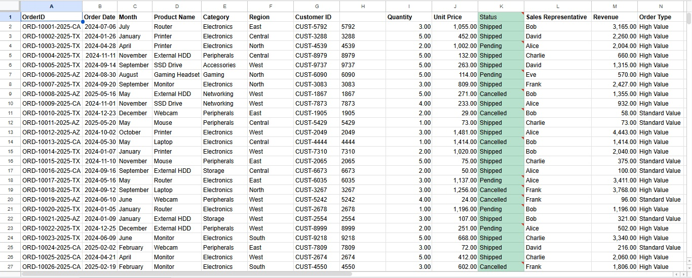
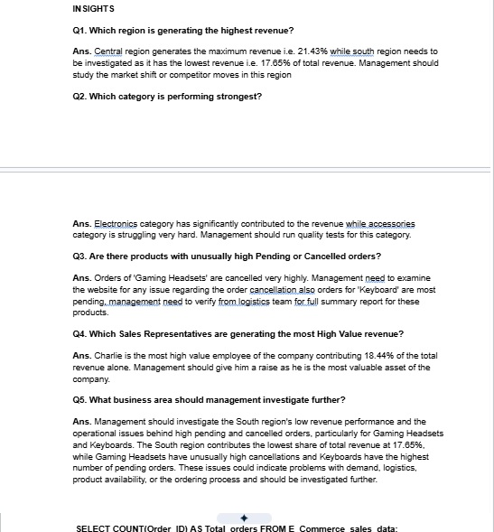

# E-commerce Sales Analysis using Excel and SQL

## Project Overview
This project analyzes e-commerce sales data to understand revenue, order performance, month-over-month (MoM) trends, regional performance, category performance, product order status, and sales representative performance.

Microsoft Excel was used for data analysis, calculations, PivotTables, and visualizations, while SQL was used to query the data and answer key business questions.

The goal of the project is to turn raw sales data into meaningful business insights that can support management decision-making.
## Tools Used
Microsoft Excel — Data analysis, calculations, PivotTables, MoM analysis, and visualizations
SQL — Data querying, aggregation, filtering, grouping, and business analysis
GitHub — Project documentation and version control
## Dataset
The dataset contains e-commerce sales records with information including:

Order ID
Order Date
Month
Product Name
Category
Region
Customer ID
Quantity
Unit Price
Order Status
Sales Representative
Revenue
Order Type

The dataset was used to analyze sales performance across different business dimensions.
## Business Questions
The analysis focuses on answering the following business questions:

What is the total revenue and order performance?
How is revenue changing month-over-month?
Which region generates the highest revenue?
Which category is performing the strongest?
Which products have unusually high pending or cancelled orders?
Which sales representatives generate the most high-value revenue?
What business areas should management investigate further?
## Analysis

### Excel Analysis
Analysis performed
Revenue analysis
Order analysis
Month-over-Month (MoM) performance analysis
Regional revenue analysis
Category performance analysis
Product-level order status analysis
Sales representative performance analysis
High-value order analysis
PivotTable-based analysis
Data visualizations
### SQL Analysis
SQL was used to query the e-commerce data and answer business questions independently.

SQL analysis includes:
Total revenue
Shipped revenue
Pending revenue
Cancelled revenue
Total orders
Pending orders
Cancelled orders
High-value orders
Revenue by region
Product performance by order status
Sales representative revenue performance
Category revenue performance
Example:

SELECT Region,
       SUM(Total_Revenue) AS Region_Wise_Total_Revenue
FROM E_Commerce_sales_data
GROUP BY Region;

The complete SQL queries are available in:

E-Commerce Data Analysis.sql
SQL Anaysis (Proof of work).pdf
## Key Insights
1. Regional Performance

The Central region generated the highest share of revenue at 21.43%, while the South region generated the lowest share at 17.65%.

This indicates that the South region may require further investigation into factors affecting its sales performance.

2. Category Performance

Electronics was the strongest-performing category in terms of revenue, while Accessories showed comparatively weaker performance.

3. Product Order Status

Gaming Headsets showed unusually high cancellations, while Keyboards had the highest number of pending orders.

These patterns may indicate potential issues related to product availability, logistics, or the ordering process and warrant further investigation.

4. Sales Representative Performance

Charlie generated the highest share of high-value revenue, contributing 18.44% of total revenue according to the analysis.
## Recommendations
Management should investigate the South region's low revenue performance and product-level order issues, particularly pending Keyboard orders and cancelled Gaming Headset orders.

Further investigation into regional demand, product availability, logistics, and the ordering process could help identify the underlying causes.
## Dashboard
### Dataset

### Metrics & Pivot Tables

### Pivot Table Analysis

### Data Visualizations

### Business Insights

##  SQL Analysis

### SQL Analysis

### SQL Queries

## Project Structure
E-Commerce-Sales-Analysis-SQL-Excel/ 
│ 
├── Screenshots/ 
│ ├── Data Visualizations.jpg 
│ ├── Dataset.jpg │ ├── Insights.jpg 
│ ├── Metrices & Pivot tables.jpg 
│ ├── Pivot table.jpg 
│ ├── SQL Analysis.jpg 
│ └── SQL queries.jpg 
│ 
├── E-Commerce Data Analysis.sql 
├── E-Commerce Data Analysis.xlsx 
├── SQL Anaysis (Proof of work).pdf 
└── README.md
## Conclusion

This project demonstrates an end-to-end approach to e-commerce sales analysis using Excel and SQL.

Excel was used to explore and visualize the data, perform MoM analysis, and identify trends, while SQL was used to query and analyze the data from a business perspective.

The project helped identify regional, category, product, and sales representative performance patterns and translate those findings into areas for further business investigation.
